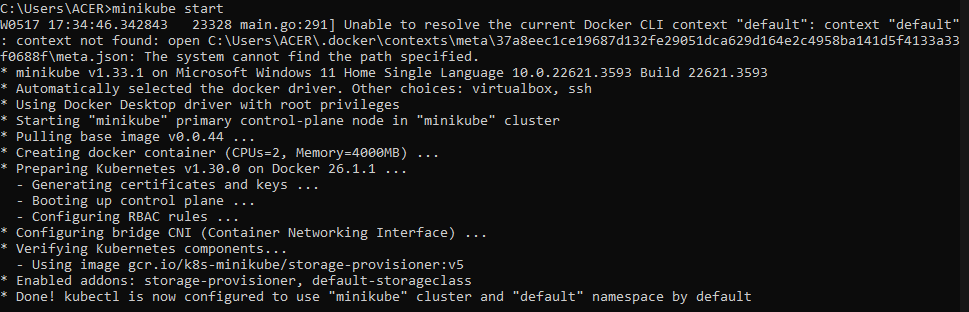

## Reflection On Hello Minikube

1. Compare the application logs before and after you exposed it as a Service. Try to open the app several times while the proxy into the Service is running. What do you see in the logs? Does the number of logs increase each time you open the app?

Ketika saya mencoba melakukan pengecekan *log* sebelum dan setelah ter*expose* sebagai *service* terdapat perbedaan pada isi log. Jika saya mengecek isi *log* sebelum ter*expose* maka isinya hanya log terkait started http dan udp server pada port 8080. Lalu ketika saya mengecek *log* setelah aplikasi ter*expose* maka terdapat berbagai history terkait http request get. Menurut saya, ini muncul ketika saya membuka aplikasi karena setiap saya melakukan *refresh* pada web ketika membuka aplikasi tersebut maka *log* terkait http request get nya bertambah. Berikut lampiran percobaannya:  

  
  
  

2. Notice that there are two versions of `kubectl get` invocation during this tutorial section. The first does not have any option, while the latter has `-n` option with value set to `kube-system`. What is the purpose of the `-n` option and why did the output not list the pods/services that you explicitly created?  

Opsi `-n` pada perintah `kubectl` digunakan untuk menentukan namespace tertentu pada *cluster* Kubernetes. Pada Kubernetes, *namespace* digunakan untuk memisahkan objek dalam kluster agar sumber daya lebih terorganisir dan terisolasi. Jika menggunakan opsi `-n kube-system`, perintah kubectl get hanya akan menampilkan objek yang berada di dalam namespace kube-system. Alasan output tidak menampilkan pods/services secara eksplisit adalah sumber daya tersebut kemungkinan besar dibuat pada *namespace* lain.  

## Reflection on Rolling Update & Kubernetes Manifest File

1. What is the difference between Rolling Update and Recreate deployment strategy?

Perbedaan utama strategi rolling update dan recreate deployment adalah bahwa pada recreate deployment akan terjadi downtime antara pembaruan aplikasi karena strategi ini mengharuskan penghapusan aplikasi yang lama sebelum menerapkan aplikasi yang baru. Akibatnya, ada periode waktu di mana aplikasi tidak tersedia hingga proses deployment selesai. Sebaliknya, rolling update secara bertahap memperbarui aplikasi ke versi terbaru, sehingga mengurangi atau menghilangkan downtime dengan mengganti instans lama dengan yang baru secara perlahan.  

2. Try deploying the Spring Petclinic REST using Recreate deployment strategy and document your attempt.

Berikut langkah-langkah yang saya lakukan:  
  
  
  
  
  
  

Berdasarkan lampiran *screenshot*, terlihat bahwa Spring Petclinic REST telah berhasil di-*deploy* menggunakan strategi Recreate. Pada bagian atas *screenshot*, perintah untuk menghapus pod telah dijalankan. Setelah perintah tersebut, bisa terlihat bahwa pod-pod lama dihapus terlebih dahulu sebelum pod baru dibuat. Proses ini menyebabkan downtime singkat, namun pod baru segera menggantikan pod lama sehingga aplikasi kembali berjalan dengan cepat. Selain itu, pada *screenshot* juga menunjukkan bahwa service berjalan di localhost, memungkinkan akses melalui URL yang diberikan.

3. Prepare different manifest files for executing Recreate deployment strategy.

Berikut langkah-langkah yang saya lakukan:  
  
  
  
  

Berdasarkan lampiran *screenshot*,  terlihat bahwa ketika kita image pada deployment spring-petclinic-rest diganti, pods yang lama akan dihapus dan kemudian pod baru akan dibuat secara serentak sesuai dengan metode strategi Recreate. Strategi ini menyebabkan downtime sementara selama proses pergantian image karena semua pod lama dihapus sebelum pod baru dibuat.  

4. What do you think are the benefits of using Kubernetes manifest files? Recall your experience in deploying the app manually and compare it to your experience when deploying the same app by applying the manifest files (i.e., invoking `kubectl apply -f` command) to the cluster.

Menurut saya, keuntungan dengan menggunakan *manifest files* sangatlah berguna. Hal ini dapat membantu apalagi dalam hal efisiensi. Dengan menggunakan *manifest files* deployment menjadi konsisten karena semua konfigurasi tersimpan dalam file YAML yang dapat versi kontrol sehingga mengurangi *human error*. Lalu proses deploy juga lebih cepat dan mudah, hanya dengan menjalankan perintah kubectl apply -f <file.yaml>, dibandingkan dengan manual yang memerlukan banyak langkah dan rentan terhadap kesalahan.  

 

